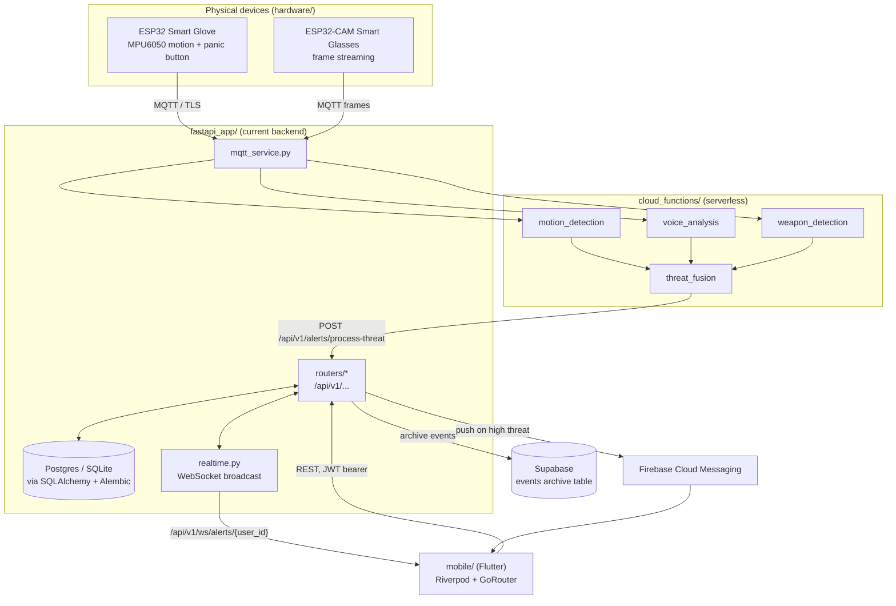
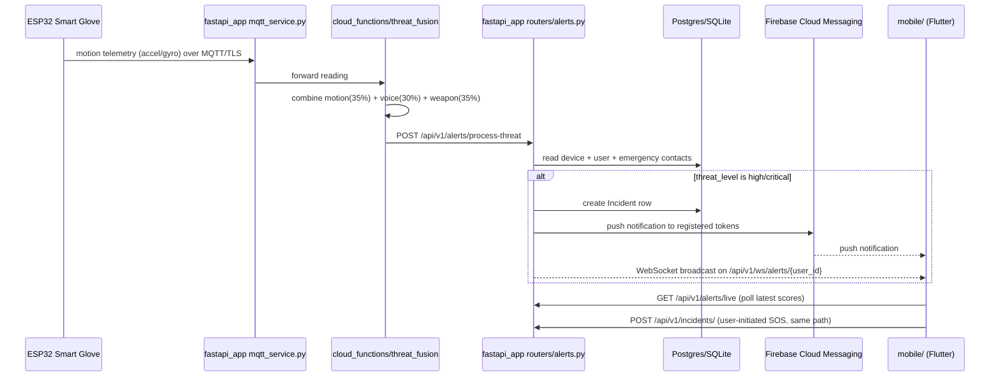
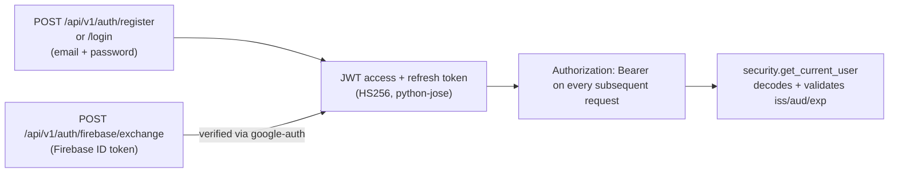

# Architecture

## System overview

SafeHer has one live backend (`fastapi_app/`), one live frontend (`mobile/`), and a set
of supporting systems that feed data into or receive commands from the backend. A
second, older backend (`legacy_flask_gateway/`) exists in the repo but is not part of
any running path today.

## Request flow: an emergency alert end to end

## Auth flow

Two entry points converge on the same JWT session:

Passwords are hashed with `passlib` (`pbkdf2_sha256`, with `bcrypt` accepted for
legacy hashes). There are no server-side sessions — logout is client-side token
deletion. Full detail: [API.md](API.md#authentication), [SECURITY.md](SECURITY.md).

## Data flow and storage tiers

| Store | Holds | Written by |
|---|---|---|
| Postgres (prod) / SQLite (dev) | Users, incidents, devices, locations, media refs, notification logs, FCM tokens, emergency contacts | `fastapi_app/repositories/*` via SQLAlchemy, schema owned by `alembic/` |
| Supabase (`events` table, `supabase_setup.sql`) | Append-only archive of raw events, parallel to the transactional DB, not a replacement for it | `fastapi_app` (see `config.py` Supabase settings) and previously `legacy_flask_gateway/core/api_gateway.py`'s archive endpoints |
| Redis | Real-time pub/sub for the event-processing pipeline (`deployment/docker/docker-compose.yml`) | `deployment/docker/safeher_event_processor.py` |
| Hive (mobile, on-device) | Auth/session state, onboarding flags, offline action queue | `mobile/lib/core/local/`, `mobile/lib/core/offline/` |
| Mosquitto (MQTT broker) | Transport only, no persistence | Devices publish, `fastapi_app/mqtt_service.py` subscribes |

## Folder responsibilities

See [PROJECT_STRUCTURE.md](PROJECT_STRUCTURE.md) for the full tree. In one line each:

- **`fastapi_app/`** — the only backend that `mobile/` and the device firmware actually
  talk to. Owns auth, incidents, devices, notifications, alerts, and the WebSocket feed.
- **`mobile/`** — the user-facing app. Currently mock-backed for most screens (see
  `AppFlavor.isMock` in `mobile/lib/core/config`); real API wiring is an in-progress,
  screen-by-screen migration, not yet complete for every feature.
- **`legacy_flask_gateway/`** — historical reference only. Not started by
  `deployment/docker/docker-compose.yml`, not imported by anything else in the repo.
- **`ml_training/`** — produces the model artifacts (`xgboost_motion_model.json`,
  `motion_training_results.json`) that `cloud_functions/motion_detection/` loads.
  Training is not reproducible from a fresh clone — the raw dataset directory
  `validate_dataset.py` expects isn't committed.
- **`hardware/`** — firmware for the two devices that actually have code: the smart
  glove and the smart glasses. No firmware exists for a "smart ring" or "pendant"
  despite both appearing in the mobile UI (see Known Gaps below).
- **`cloud_functions/`** — the ML inference layer, deployable independently of the
  main backend. `threat_fusion` is what `fastapi_app/routers/alerts.py` ultimately
  calls through `services/processor_client.py`.
- **`deployment/`** — the only actively-used deployment path is
  `deployment/docker/docker-compose.yml`, a 4-container stack (Postgres, Redis,
  Mosquitto, one unified event-processor). `deployment/config/nginx.conf` and
  `prometheus.yml` describe an earlier, larger microservices design that compose
  file's own comments mark as removed.

## Backend/frontend communication

- **REST**: `mobile/` calls `fastapi_app`'s `/api/v1/*` routes over HTTPS via `dio`,
  with `Authorization: Bearer <jwt>` once authenticated.
- **Realtime**: `fastapi_app/routers/ws.py` exposes a WebSocket at
  `/api/v1/ws/alerts/{user_id}`; the mobile app is designed to attach for live threat
  updates on the monitoring/dashboard screens (Phase 4/5 of the mobile rebuild covers
  wiring this in against the real backend instead of a mock stream).
- **Push**: high-severity alerts also go out via FCM independent of whether the app
  has an open WebSocket connection, so notifications work even when the app is backgrounded.

## Known gaps

Carried forward from the pre-audit documentation (`docs/archive/PROJECT_STATUS.md`,
`TECHNICAL_INVENTORY.md`) and reconfirmed during the 2026-08-08 audit:

- Weapon detection and voice analysis in `cloud_functions/` fall back to
  `_create_synthetic_model()` in places — real trained models for those two modalities
  were not fully wired in as of this audit.
- No firmware exists for the "smart ring" or "pendant" device concepts shown in the
  mobile UI — only the glove and glasses are real.
- `mobile/`'s API integration layer (Phase 4 of its build) is in progress; most screens
  are still backed by mock repositories rather than `fastapi_app`.
- The ML training pipeline (`ml_training/`) cannot be re-run from a clean clone — the
  raw dataset it expects at `dataset/raw/*.csv` is not committed.
