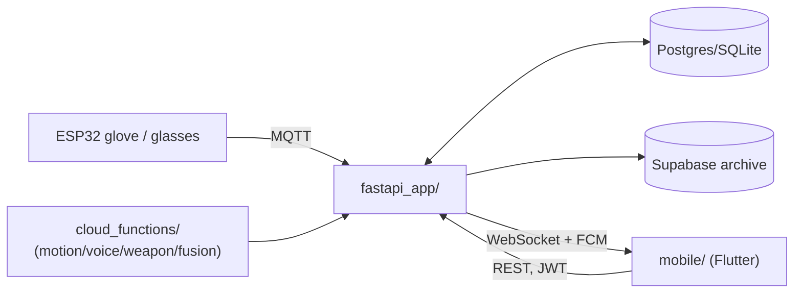

# SafeHer

An AI-powered wearable safety platform for women — smart-device firmware, a threat-detection
backend, and a Flutter mobile app, built around one idea: detect a threat (motion, voice,
or visual) fast enough to alert a user's emergency contacts before they have to.

> **Documentation map:** this README covers setup and orientation. For depth, see
> [ARCHITECTURE.md](ARCHITECTURE.md) (how the pieces fit together, with diagrams),
> [API.md](API.md) (every backend endpoint), [SETUP.md](SETUP.md) (detailed local
> setup + troubleshooting), [PROJECT_STRUCTURE.md](PROJECT_STRUCTURE.md) (folder-by-folder
> tour), [SECURITY.md](SECURITY.md), [DEPENDENCIES.md](DEPENDENCIES.md),
> [CONTRIBUTING.md](CONTRIBUTING.md), and [CHANGELOG.md](CHANGELOG.md).

## What's actually here

This repo holds three things that share history but not a runtime:

1. **A current backend** (`fastapi_app/`) — FastAPI, JWT + Firebase auth, Postgres/SQLite
   via SQLAlchemy + Alembic, MQTT ingestion from devices, WebSocket + FCM push for alerts.
2. **A mobile app** (`mobile/`) — Flutter, Riverpod, GoRouter, Clean Architecture per
   feature. Every screen now talks to the real backend by default (auth, contacts,
   emergency dispatch, devices, dashboard, reports, live monitoring over WebSocket, BLE
   pairing, settings); a fixture-data mock flavor remains available via
   `--dart-define=USE_MOCK_API=true` for UI-only exploration without a backend running.
3. **Supporting systems** — ESP32 firmware for two physical devices (`hardware/`), an
   offline ML training pipeline (`ml_training/`), serverless inference functions
   (`cloud_functions/`), and a Docker Compose deployment (`deployment/`).

## Features

- **Multi-modal threat detection**: motion (accelerometer/gyro via XGBoost), voice
  distress, and visual weapon detection, combined into one fused threat score
  (`cloud_functions/threat_fusion`).
- **Emergency SOS**: one-tap or auto-triggered alert that creates an incident, notifies
  emergency contacts, and pushes to the user's devices — `POST /api/v1/alerts/emergency`.
- **Live monitoring**: periodic heartbeats update a rolling threat score the mobile app
  can poll or subscribe to over WebSocket.
- **Device management**: pairing, heartbeat/battery tracking for wearables — currently
  real for the smart glove and smart glasses; the "smart ring" and "pendant" seen in the
  mobile UI are product-vision concepts with no firmware yet (see
  [ARCHITECTURE.md#known-gaps](ARCHITECTURE.md#known-gaps)).
- **Evidence capture**: signed direct-to-Cloudinary uploads for incident media.
- **Hybrid auth**: email/password or Firebase sign-in, both resolving to the same JWT
  session.
- **Safe Journey**: start a trip with a destination, a deadline, and chosen contacts.
  Real GPS breadcrumbs post to the backend while it runs; missing the deadline records
  an incident and notifies — `POST /api/v1/journeys`.
- **Nearby Safety**: real police stations, hospitals, pharmacies, transit stops and
  shelters around the user's actual position, with true distances, from OpenStreetMap
  via `GET /api/v1/safety/nearby`.
- **Emergency Cancel PIN**: a hashed, server-side PIN that must be entered to stand a
  triggered SOS down. Never stored on the device.
- **Opt-in phone triggers**: shake-to-SOS (three deliberate shakes, debounced, opens the
  normal countdown) and an on-device voice-command layer over a fixed command list.
- **Safety toolkit**: Fake Call, published emergency helplines, and short original
  safety/self-defence guides.

## Tech stack

| Layer | Tech |
|---|---|
| Backend | Python 3, FastAPI, SQLAlchemy 2.0 (async), Alembic, python-jose, passlib |
| Backend datastores | Postgres (prod) / SQLite (dev), Redis, Supabase (events archive) |
| Realtime transport | MQTT (Mosquitto), WebSocket |
| Mobile | Flutter, Riverpod (codegen), GoRouter, Hive, Dio, golden_toolkit |
| ML | XGBoost, scikit-learn, PyTorch/ultralytics (weapon detection), librosa (voice) |
| Firmware | ESP32 (Arduino), MPU6050, ESP32-CAM |
| Deployment | Docker Compose (Postgres + Redis + Mosquitto + event processor) |

Full list with rationale: [DEPENDENCIES.md](DEPENDENCIES.md).

## Architecture overview



Full diagrams and data-flow detail: [ARCHITECTURE.md](ARCHITECTURE.md).

## Folder structure

See [PROJECT_STRUCTURE.md](PROJECT_STRUCTURE.md) for the complete, annotated tree.

## Prerequisites

- Python 3.11+ (backend, ML training)
- Flutter 3.x / Dart 3.8+ (mobile — see `mobile/pubspec.yaml` for the exact SDK constraint)
- Docker + Docker Compose (full local stack: Postgres, Redis, Mosquitto)
- A Supabase project (only if you need the events-archive feature — the backend runs
  without it, just with that feature disabled)

## Environment variables

Copy `.env.example` to `.env` at the repo root and fill in real values before running
anything. See [SETUP.md](SETUP.md#2-environment-variables) for what each variable does and
[SECURITY.md](SECURITY.md) for which ones are secrets you must never commit.

## Running locally

Quick path — full stack via Docker Compose:
```bash
cp .env.example .env   # fill in real values
python manage.py start
python manage.py status
```

Backend only, without Docker:
```bash
pip install -r requirements.txt
python app.py
```

Mobile app:
```bash
cd mobile
flutter pub get
flutter run
```

Full walkthrough, including troubleshooting common first-run issues:
[SETUP.md](SETUP.md).

## Development workflow

- Backend changes: edit under `fastapi_app/`, add an Alembic migration if the schema
  changed (`alembic revision --autogenerate -m "..."`), run `pytest tests/`.
- Mobile changes: this codebase follows a strict build discipline — Riverpod only (no
  `setState`), GoRouter only (no direct `Navigator.push`), custom vector icons (no
  Material defaults), and every component/screen gets a widget test and golden test
  before being considered done. See `mobile/` for the existing pattern to follow.
- Both: see [CONTRIBUTING.md](CONTRIBUTING.md) for branch/commit conventions.

## Build instructions

```bash
# Mobile release APK
cd mobile && flutter build apk --release

# Backend container image
docker compose -f deployment/docker/docker-compose.yml build
```

## Testing

```bash
# Backend
pytest tests/

# Mobile
cd mobile && flutter test
```

The in-process suites are the reliable ones and need no running server:
`test_fastapi_contracts.py`, `test_safety_contracts.py`, `test_auth_security.py`,
`test_auth_provisioning.py` and `test_firebase_token_verification.py` (67 tests).
`test_api_gateway.py` and `test_integration.py` drive a **live** server over HTTP, so
start the backend first or they will fail on connection. Details:
[PROJECT_STRUCTURE.md](PROJECT_STRUCTURE.md#tests-backend-pytest).

## Deployment

The only actively-maintained deployment path is `deployment/docker/docker-compose.yml`
(Postgres + Redis + Mosquitto + one unified event-processor container), managed via
`manage.py`. `deployment/config/nginx.conf` and `prometheus.yml` describe an earlier,
larger microservices design that isn't wired into the current compose file — see
[ARCHITECTURE.md](ARCHITECTURE.md) before assuming they're live.

## API overview

Every endpoint, request/response shape, and auth requirement: [API.md](API.md).

## Screenshots

_Mobile app screens (auth flow through Home) are captured in the project's working
session, not checked into this repo as static images yet. Add real screenshots here as
each screen is finalized — `mobile/lib/features/*/presentation/`._

| Screen | Preview |
|---|---|
| Splash | _add screenshot_ |
| Onboarding | _add screenshot_ |
| Login / Signup | _add screenshot_ |
| Home | _add screenshot_ |

## Known limitations

- Weapon and voice threat detection use synthetic-fallback models in places — not yet
  fully backed by trained models (`cloud_functions/weapon_detection`, `voice_analysis`).
- `/api/v1/alerts/live` state is in-process and resets on backend restart — see
  [API.md](API.md#alerts-apiv1alerts--the-core-threat-pipeline).
- The ML training pipeline can't be re-run from a clean clone — the raw dataset isn't
  committed (`ml_training/motion_detection/`, `validate_dataset.py`).
- No firmware exists yet for the "smart ring" or "pendant" devices shown in the mobile UI.
- BLE pairing is implemented against the real `flutter_blue_plus` API (real permissions,
  real scan, real connect) but unverified end-to-end — there's no Bluetooth radio in the
  dev/CI environment and no physical SafeHer peripheral to pair with.
- No backend CI exists yet — only `mobile-ci.yml` runs (Flutter analyze + test).

## Future improvements

- Verify BLE pairing against real Smart Glove / Smart Glasses hardware once available.
- Move `/alerts/live` scoring into Redis or the database so it survives restarts and
  scales across replicas.
- Add a backend CI workflow (pytest, at minimum against `test_fastapi_contracts.py`).
- Recommit or document how to regenerate the ML training dataset so
  `ml_training/motion_detection/train_motion_model.py` is actually reproducible.
- Firmware for the smart ring / pendant, if those remain in the product plan.

## Contributing

See [CONTRIBUTING.md](CONTRIBUTING.md).

## License

MIT — see [LICENSE](LICENSE).

## Authors

SafeHer Team (see `git log` for current contributors).

## Acknowledgements

Built on FastAPI, Flutter/Riverpod, SQLAlchemy, XGBoost, and Supabase. Historical
project reports and an earlier architecture snapshot are preserved in
[docs/archive/](docs/archive/) for context on how this codebase evolved.

Several phone-side safety features — Safe Journey, Nearby Safety, the Emergency Cancel
PIN, shake-to-trigger, voice commands, Fake Call, and the helplines directory — were
inspired by [GoSecure](https://github.com/Divijkatyal0406/GoSecure) (MIT licensed).
They were **reimplemented from scratch** against SafeHer's own architecture rather than
ported: no GoSecure source, assets, or dependencies are vendored into this repo. See
[ARCHITECTURE.md](ARCHITECTURE.md#adapted-from-gosecure) for what was adopted, what was
rebuilt differently, and what was deliberately rejected.
