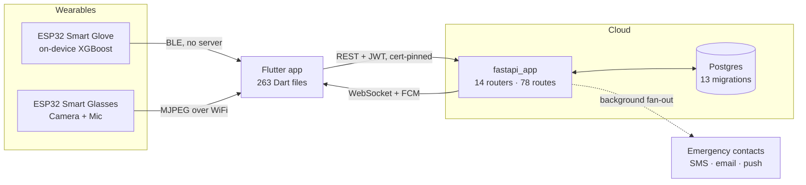

<div align="center">


# SafeHer

**An AI-powered wearable safety platform for women.**

Detect a threat — by motion, voice, or sight — and get help moving
*before* she has to reach for her phone.

[](https://github.com/ShadowInCache/SafeHer/actions/workflows/backend-ci.yml)
[](https://github.com/ShadowInCache/SafeHer/actions/workflows/mobile-ci.yml)
[](LICENSE)


</div>

---

## The problem this solves

An emergency app that needs you to unlock your phone, find the app, and press
a button has already failed the situations that matter most. SafeHer is built
around one requirement: **an alert gets out**. Everything else — the models,
the wearables, the dashboards — exists to serve that.

That requirement shapes the engineering in ways worth stating up front:

- The SOS **never waits on a slow channel.** The alert commits and answers in
  well under a second; contacting people happens after.
- The app **never claims someone was reached** unless the server says so.
- When something fails, the screen **says what actually failed** and what to
  do instead. A reassuring lie is the worst possible output here.

---

## Features

### Emergency

| | |
|---|---|
| **One-tap SOS** | 10-second cancellable countdown (5/10/15s configurable), then dispatch. A centre FAB on the main navigation, plus shake-to-trigger and voice from anywhere. |
| **Auto-SOS** | Fires without interaction when a threat crosses your threshold. A paired **Smart Glove** drives this today — it runs its model on the ESP32 and reaches the phone over BLE, and a foreground service keeps it detecting with the screen off. During a Safe Journey the phone-side weapon and audio detectors also feed the fused threat score; each source is labelled so the app never implies one covers the others. |
| **Contact fan-out** | Up to 10 contacts in your own priority order, each attempted independently on SMS → email → push, 3 attempts per channel. |
| **Evidence capture** | Audio (and video when the camera can open) starts **with the countdown**, not after dispatch — so it covers the seconds spent deciding. AES-256-GCM at rest in a private Supabase bucket, owner-only retrieval — the provider holds ciphertext it cannot read. |
| **Offline queue** | No signal? The alert is stored and replays on reconnect — driven by a periodic sweep and app-resume, not just a connectivity event. |
| **Cancel PIN** | Optional server-side hashed PIN required to stand an alert down. Never stored on the device. |
| **One-tap 112** | Fills the dialler. It cannot auto-dial — Android forbids `ACTION_CALL` for emergency numbers, and that's the right behaviour anyway. |

### Detection & monitoring

**On the glove, today.** A paired Smart Glove classifies hand motion on the
ESP32 at 100 Hz and notifies the phone over BLE with no server in the path.
The app raises the alarm on two `FALL` readings inside five seconds, each above
your confidence threshold — one alone is a glove dropped on a table. It opens
the ordinary cancellable countdown; an automatic trigger must never be faster,
quieter or harder to stop than one you asked for. A foreground service keeps
this running with the phone in a pocket, and the app only claims that when the
platform confirms the service actually started.

**All three signals now have a producer, and fusion runs on the phone.**
Multi-modal fusion per SRS §6.2 combines a smoothed threat score with context
boosters and a 120s dedup window, fed by: **motion** on the glove (XGBoost on
the ESP32, over BLE), **weapon** on the phone (YOLOv8 via `ultralytics_yolo` on
Android, with a server-side frame fallback on web), and **voice distress** on
the phone (a pure-Dart TF-IDF + logistic-regression phrase classifier over the
platform speech recogniser — the CNN+LSTM keyword model was dropped). The
decision path is complete and tested; what remains is running each signal
against a real feed rather than a fake one.

Every automatic incident records **why it fired**: per-modality scores, weapon
confidence, the fused value, and the threshold it was compared against, turned
into a plain sentence — *"Sudden, violent movement was detected. A knife was
detected in view."* A weapon below the 0.70 floor is deliberately **not**
named, and an absent sensor is stated as absent rather than read as "saw
nothing".

### Safety toolkit

Safe Journey (destination + deadline + watchers, real GPS breadcrumbs,
auto-escalation on a missed deadline) · Nearby Safety (real police, hospitals,
pharmacies, transit and shelters from OpenStreetMap) · Fake Call · Shake-to-SOS
· on-device voice commands · published helplines · original safety guides.

### Reports & privacy

Forensic PDF export with per-recording SHA-256 and a document hash ·
incident timeline · 14-day threat history · safety heatmap · 7-day expiring
share links (revocable, evidence streamed per request) · **full data export**
(GDPR Art. 15) · account deletion with a 30-day grace period (Art. 17).

---

## Architecture



**One deployable, not ten services.** The SRS specifies ten microservices on
ports 8000–8009; this runs one FastAPI app with fourteen routers behind the
same boundaries. Splitting it would add ten failure modes to a product whose
defining requirement is that an alert gets out. Full reasoning and the other
deliberate deviations: [docs/SRS_STATUS.md](docs/SRS_STATUS.md#deliberate-deviations).

---

## Tech stack

| Layer | Technology |
|---|---|
| **Backend** | FastAPI · SQLAlchemy 2.0 (async) · Alembic · python-jose · passlib |
| **Data** | Postgres (prod, Neon) / SQLite (dev) · Redis · Supabase (events archive + encrypted evidence bucket) |
| **Realtime** | MQTT (Mosquitto) · WebSocket |
| **Mobile** | Flutter · Riverpod (codegen) · GoRouter · Hive · Dio · golden_toolkit |
| **ML** | XGBoost · scikit-learn · PyTorch/Ultralytics · librosa |
| **Firmware** | ESP32 (Arduino) · MPU6050 · ESP32-CAM |
| **Auth** | Backend JWT (15 min + 30-day refresh) · Firebase (Google/Apple/phone) |
| **Delivery** | Brevo (HTTPS email) · Twilio (SMS) · FCM (push) |
| **Deploy** | Render (API) · Docker Compose (local stack) |

---

## Repository layout

```
SafeHer/
├── fastapi_app/       Backend — 14 routers, 73 routes, services, workers
├── mobile/            Flutter app — clean architecture per feature
├── glove/             Smart glove — firmware, dataset, on-device ML pipeline
├── alembic/           Database migrations (13, reversible)
├── tests/             Backend test suite (pytest)
├── ml_models/         Server-side ONNX for the web weapon fallback
├── glasses/           Smart glasses — streaming firmware (runs no model)
├── deployment/        Docker Compose stack, configs, SQL
├── scripts/           Operational scripts
└── docs/              Every project document (see below)
```

---

## Quick start

**Prerequisites:** Python 3.12+ · Flutter 3.x / Dart 3.8+ · Docker (optional)

```bash
git clone https://github.com/ShadowInCache/SafeHer.git
cd SafeHer
cp .env.example .env          # fill in real values first
```

<details>
<summary><b>Backend</b></summary>

```bash
pip install -r requirements.txt
alembic upgrade head
python app.py                 # OpenAPI at /api/v1/docs
```

Full stack with Postgres + Redis + Mosquitto:

```bash
python manage.py start && python manage.py status
```
</details>

<details>
<summary><b>Mobile</b></summary>

```bash
cd mobile
flutter pub get
flutter run                   # talks to the deployed backend by default
```

Point it somewhere else, or run without a backend at all:

```bash
flutter run --dart-define=API_BASE_URL=http://10.0.2.2:5000/api/v1   # emulator → host
flutter run --dart-define=USE_MOCK_API=true                          # fixture data, no server
```
</details>

<details>
<summary><b>Making email actually deliver</b></summary>

Set `BREVO_API_KEY` in `.env`. Email goes out over HTTPS rather than SMTP for
a specific reason: Render's free tier blocks outbound ports 25, 465 and 587,
so a correct SMTP implementation with valid credentials silently times out in
production while passing every test locally. HTTPS on 443 is not blocked.

Brevo also verifies an *individual sender address* rather than demanding a
domain you own — which is what rules OneSignal out for this project.
</details>

---

## Quality gates

Every one of these is enforced in CI and measured, not asserted.

| Gate | Status |
|---|---|
| `pytest tests/` | **483 passing**, 7 skipped |
| `flutter test` | **889 passing** |
| `flutter analyze` | **0 issues** |
| `flutter build apk --release` | **0 errors** (77.2 MB) |
| `flutter build web --release` | **0 errors** |
| Mobile line coverage | **75.2%** (SRS gate: >70%) |
| Alembic empty → head → base → head | **reversible**, verified on SQLite *and* Postgres |
| Secret/artifact scan | no `.env`, keys, DBs or evidence tracked |

Backend CI runs migrations against a **real Postgres 16 service**, not SQLite —
added after a migration containing `is_verified = 1` passed the entire suite
and then failed on production Postgres with *"operator does not exist: boolean
= integer"*, aborting mid-chain with the schema half-applied.

---

## Documentation

| Document | What's in it |
|---|---|
| [SRS.md](docs/SRS.md) | The governing spec — requirements, targets, design system |
| [SRS_STATUS.md](docs/SRS_STATUS.md) | **How much of the SRS is actually built**, with measured evidence and an append-only session log |
| [ARCHITECTURE.md](docs/ARCHITECTURE.md) | How the pieces fit, with diagrams |
| [API.md](docs/API.md) | Every endpoint, shape and auth requirement |
| [SETUP.md](docs/SETUP.md) | Detailed setup + troubleshooting |
| [SECURITY.md](docs/SECURITY.md) | Threat model, secrets handling, known limitations |
| [PROJECT_STRUCTURE.md](docs/PROJECT_STRUCTURE.md) | Folder-by-folder tour |
| [TRACEABILITY.md](docs/TRACEABILITY.md) | Requirement → code map, enforced by a test |
| [WEAPON_INFERENCE_PLACEMENT.md](docs/WEAPON_INFERENCE_PLACEMENT.md) | Where the weapon model runs, and why an ESP32 cannot hold it |
| [MEMORY.md](docs/MEMORY.md) | Append-only change history |
| [DEPENDENCIES.md](docs/DEPENDENCIES.md) · [CONTRIBUTING.md](docs/CONTRIBUTING.md) · [CHANGELOG.md](docs/CHANGELOG.md) | |

Component-level docs live with the code they describe:
[mobile/README.md](mobile/README.md) (the Flutter app, its build-time switches
and house rules) and [glove/README.md](glove/README.md) (the firmware, the
dataset, and the collect → train → convert → flash pipeline).

---

## Honest status

This section is the point of the README. A safety product that overstates
what it does is worse than one that does less.

**Working and verified end to end** — SOS dispatch, contact fan-out with
per-contact outcome reporting, evidence capture/encryption/upload, PDF export,
share links, contact verification, Safe Journey, Nearby Safety, auth
(email + Google), offline queue, account deletion, data export.

**Glove firmware validated on real hardware; the app path still is not.** On
2026-09-10 a real ESP32-C3 was exercised (report:
[`glove/firmware/SafeHer_Glove_Final/HARDWARE_VALIDATION_REPORT.md`](glove/firmware/SafeHer_Glove_Final/HARDWARE_VALIDATION_REPORT.md)):
the MPU-6500 is detected, sampling holds 100 Hz with negligible jitter, and the
on-device 7-class inference runs at ~31 ms/window with sampling never starved.
That pass also found two previously-invisible build bugs — the inference build
overflows the default flash partition (needs `huge_app`), and `USB CDC On Boot`
must be enabled or serial is silent — and that the production sketch still ships
in `DATA_COLLECTION_MODE=1` (a raw logger, not the classifier). What is **still
unverified**: physical motion/FALL behaviour, BLE-connected behaviour, and
pairing with the app. Every app-side test runs against a fake BLE service, and
**no physical glove has ever been paired with the phone.** iOS has never been
compiled — the `GoogleService-Info.plist` registration is the one change nobody
has built.

**Platforms** — Android is the primary target and web compiles clean as of
2026-08-30. iOS is out of scope. A web build has no glove: `flutter_blue_plus`
has no web implementation, so BLE and everything downstream of it are absent
there, and the app reports that rather than implying otherwise.

**Blocked by environment, not by code** — SMS costs money with every provider
and is unconfigured.

**Not built** — firmware OTA (FR-DEV-04), named device sets (FR-DEV-06), live
video from the glasses (FR-MON-02), AI-generated incident summaries (FR-RPT-01,
needs a paid model API).

**All three detectors now exist and are wired; none is verified against a real
feed.**

The **glove** classifies on the ESP32 and the app acts on it over BLE (firmware
now hardware-validated standalone; see above). The **weapon detector** is
trained (mAP@0.5 0.907, knife AP 0.884 on a held-out split) and now has a
producer: `ultralytics_weapon_detector.dart` scores frames on-device on Android,
`remote_weapon_detector.dart` uploads a sampled frame to the server on web, and
`weapon_scorer.dart` votes over a window — but nothing has yet fed it a real
glasses stream. The **audio** signal exists as a pure-Dart phrase classifier
(`threat_phrase_classifier.dart` + `phrase_classifier.json`) over the platform
speech recogniser; it is measured on synthetic and degraded TTS, **not on real
distress speech**, which no public dataset supplies and which is out of scope
for now.

The tempting shortcut — publishing the phone's accelerometer magnitude as a
"motion score" — was deliberately **not** taken. It would be an invented number
wearing a model's name, and it would alert every emergency contact on a dropped
phone or a run for a bus. Each false alarm spends the credibility the real
alert depends on.

So the remaining gap is not code but real-feed verification: pairing a glove,
pointing the glasses at a real scene, and speaking real distress. Without any
wearable, the phone's honest trigger stays the deliberate shake gesture, which
opens the countdown rather than dispatching, and that works today.

Requirement-by-requirement detail: [docs/SRS_STATUS.md](docs/SRS_STATUS.md).

---

## Roadmap

- [x] Validate the glove firmware on real hardware — done 2026-09-10 (sensor,
      100 Hz sampling, on-device inference timing on a real ESP32-C3); found the
      `huge_app` partition and `USB CDC On Boot` build fixes
- [ ] **Pair a physical glove with the app and verify the whole path** — the
      single item that turns merged, tested, hardware-validated-but-unpaired work
      into something to trust. Procedure: [docs/HARDWARE_BRINGUP.md](docs/HARDWARE_BRINGUP.md)
- [ ] Run the production sketch's motion/FALL/BLE tests (it still ships in
      `DATA_COLLECTION_MODE=1`; flip to `0` and reflash first)
- [ ] Collect the recordings the evaluation harness asked for — more `NORMAL`
      resembling `normal_020`, more marginal falls resembling `fall_018`
- [ ] Send only the telemetry fields the firmware measures, instead of zeros
- [x] Train the weapon detector — done 2026-08-31 (mAP@0.5 0.907)
- [x] **Wire the weapon model into the app** — done: on-device on Android
      (`ultralytics_yolo`), server frame-fallback on web; still needs a real
      glasses stream
- [x] Train the facial-expression classifier — done 2026-09-01, 65.5%, and
      `fear` is its weakest class at 47% recall; supporting evidence only
- [x] Ship the audio distress signal — a pure-Dart TF-IDF + logistic-regression
      phrase classifier over platform ASR replaced the CNN+LSTM keyword model
      (which scored below a fuzzy string match on real phrases)
- [ ] ~~Record a real distress corpus~~ — deferred (no public dataset supplies
      it; out of scope for now, so audio stays validated on synthetic/degraded TTS)
- [ ] Point the glasses at a real scene and confirm the weapon path end to end
- [ ] Verify a deployed web build end to end (it compiles; nobody has used it)
- [ ] Move `/alerts/live` scoring into Redis so it survives restarts
- [ ] Sweep for stale `in_progress` dispatches (a killed worker currently strands one)
- [ ] Attach evidence to contact email when under the size cap
- [ ] Firmware for the smart ring / pendant, if they stay in the plan

---

## Contributing

See [CONTRIBUTING.md](docs/CONTRIBUTING.md). The mobile codebase follows a
strict discipline: Riverpod only (no `setState`), GoRouter only (no direct
`Navigator.push`), custom vector icons, and a widget test **plus** a golden
test in both themes before any component is considered done.

## License

MIT — see [LICENSE](LICENSE).

## Acknowledgements

Built on FastAPI, Flutter/Riverpod, SQLAlchemy and XGBoost.

Several phone-side features — Safe Journey, Nearby Safety, the Cancel PIN,
shake-to-trigger, voice commands, Fake Call and the helplines directory — were
inspired by [GoSecure](https://github.com/Divijkatyal0406/GoSecure) (MIT).
They were **reimplemented from scratch** against SafeHer's own architecture:
no GoSecure source, assets or dependencies are vendored here. What was adopted,
what was rebuilt differently, and what was deliberately rejected is documented
in [ARCHITECTURE.md](docs/ARCHITECTURE.md#adapted-from-gosecure).

<div align="center">
<sub>Built for the people who shouldn't have to think about this.</sub>
</div>
