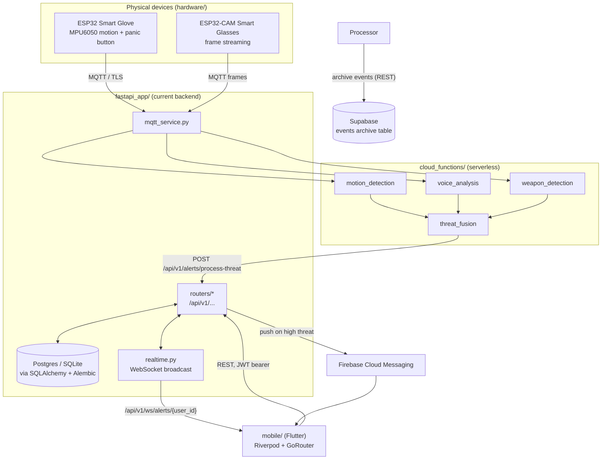
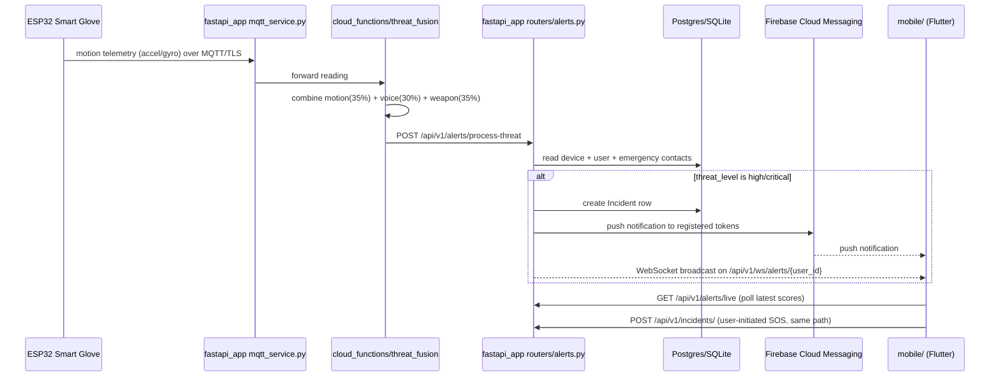
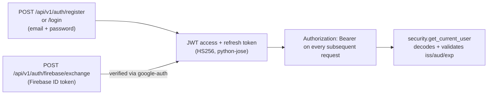

# Architecture

## System overview

SafeHer has one backend (`fastapi_app/`), one frontend (`mobile/`), and a set of
supporting systems that feed data into or receive commands from the backend. The older
Flask gateway that `fastapi_app/` replaced was deleted on 2026-08-15 after confirming
nothing imported it; it remains in git history if it is ever needed.

## Request flow: an emergency alert end to end

## Auth flow

Two entry points converge on the same JWT session:

Passwords are hashed with `passlib` (`pbkdf2_sha256`, with `bcrypt` accepted for
legacy hashes). There are no server-side sessions — logout is client-side token
deletion. Full detail: [API.md](API.md#authentication), [SECURITY.md](SECURITY.md).

## Data flow and storage tiers

| Store | Holds | Written by |
|---|---|---|
| Postgres (prod) / SQLite (dev) | Users, incidents, devices, locations, media refs, notification logs, FCM tokens, emergency contacts, safe journeys, hashed safety PINs, safety-trigger preferences | `fastapi_app/repositories/*` via SQLAlchemy, schema owned by `alembic/` |
| Supabase (`events` table, `supabase_setup.sql`) | Append-only archive of raw events, parallel to the transactional DB, not a replacement for it | `deployment/docker/safeher_event_processor.py` **only**, over plain REST. `fastapi_app` never touches it — it has no Supabase settings and no client. |
| Redis | Real-time pub/sub for the event-processing pipeline (`deployment/docker/docker-compose.yml`) | `deployment/docker/safeher_event_processor.py` |
| Hive (mobile, on-device) | Auth/session state, onboarding flags, offline action queue | `mobile/lib/core/local/`, `mobile/lib/core/offline/` |
| Mosquitto (MQTT broker) | Transport only, no persistence | Devices publish, `fastapi_app/mqtt_service.py` subscribes |

## Folder responsibilities

See [PROJECT_STRUCTURE.md](PROJECT_STRUCTURE.md) for the full tree. In one line each:

- **`fastapi_app/`** — the only backend that `mobile/` and the device firmware actually
  talk to. Owns auth, incidents, devices, notifications, alerts, and the WebSocket feed.
- **`mobile/`** — the user-facing app. Every screen is wired to the real backend by
  default (see `AppConfig.useMockApi` in `mobile/lib/core/config`); a fixture-data mock
  flavor remains available via `--dart-define=USE_MOCK_API=true` for UI-only exploration.
- **`ml_training/`** — produces the model artifacts (`xgboost_motion_model.json`,
  `motion_training_results.json`) that `cloud_functions/motion_detection/` loads.
  Training is not reproducible from a fresh clone — the raw dataset directory
  `scripts/validate_dataset.py` expects isn't committed.
- **`hardware/`** — firmware for the two devices that actually have code: the smart
  glove and the smart glasses. No firmware exists for a "smart ring" or "pendant"
  despite both appearing in the mobile UI (see Known Gaps below).
- **`cloud_functions/`** — the ML inference layer, deployable independently of the
  main backend. `threat_fusion` is what `fastapi_app/routers/alerts.py` ultimately
  calls through `services/processor_client.py`.
- **`deployment/`** — the only actively-used deployment path is
  `deployment/docker/docker-compose.yml`, a 4-container stack (Postgres, Redis,
  Mosquitto, one unified event-processor). `deployment/config/nginx.conf` and
  `prometheus.yml` describe an earlier, larger microservices design that compose
  file's own comments mark as removed.

## Backend/frontend communication

- **REST**: `mobile/` calls `fastapi_app`'s `/api/v1/*` routes over HTTPS via `dio`,
  with `Authorization: Bearer <jwt>` once authenticated.
- **Realtime**: `fastapi_app/routers/ws.py` exposes a WebSocket at
  `/api/v1/ws/alerts/{user_id}`; the mobile app's Live Monitoring/Dashboard screens
  attach to it for real `threat_alert`/`emergency_alert` events — there is no
  synthetic sensor stream anywhere in the mobile codebase.
- **Push**: high-severity alerts also go out via FCM independent of whether the app
  has an open WebSocket connection, so notifications work even when the app is backgrounded.

## Adapted from GoSecure

[GoSecure](https://github.com/Divijkatyal0406/GoSecure) (MIT) is a Flutter women-safety
app whose phone-side feature set overlaps with what SafeHer was missing. Its ideas were
evaluated feature by feature and the useful ones rebuilt inside SafeHer's architecture.
Nothing was ported: GoSecure targets pre-null-safety Dart 2.7 with a dozen abandoned
packages, so copying was never an option even where licensing allowed it.

| Idea | What SafeHer does instead |
|---|---|
| Nearby safety spots | GoSecure opens a `google.com/maps/search?q=police+station` URL — no coordinates, no distances, nothing structured. SafeHer proxies **OpenStreetMap Overpass** through `GET /api/v1/safety/nearby`, returning real tagged places with computed haversine distances, phone numbers where OSM has them, and a 5-minute server-side cache. Keyless, so no Places billing. |
| Periodic location sharing | GoSecure loops an SMS containing a maps link, with contacts in `SharedPreferences`. SafeHer models it as a **Safe Journey** with a deadline: breadcrumbs go into the existing `locations` table tagged with `journey_id`, contacts come from the existing `emergency_contacts` table, and the overdue policy is server-side and explicit. |
| Safety PIN | GoSecure keeps the PIN in device preferences. SafeHer hashes it server-side with the same passlib context as account passwords, rate-limits wrong guesses, and gates SOS cancellation on it. |
| Shake detection | Kept as an **opt-in fallback** for when the Smart Glove isn't worn — the glove's own motion sensing remains primary. Requires three deliberate shakes inside 1.5 s with a 10 s cooldown, and opens the normal SOS countdown rather than dispatching. |
| Voice commands | Rebuilt as an on-device recogniser over a **fixed allow-list**. Critical actions keep their guards: SOS opens the countdown, and cancelling still meets the PIN gate — a voice anyone nearby can imitate must not silence an alarm. |
| Fake call, helplines, articles, self-defence | Rebuilt with SafeHer's design system. Helpline numbers carry their source and verification date, and the screen states its country scope. Guides are original text — GoSecure's bundled articles and video embeds had unclear licensing. |
| Scream detection | **Rejected.** GoSecure thresholds a `noise_meter` dB reading, which is loudness detection, not scream detection. SafeHer already runs real voice analysis server-side on the Smart Glasses mic; adding a competing client-side detector would be both a duplicate and a weaker one. |
| Spy-camera detection (magnetometer) | **Rejected.** A magnetometer cannot reliably detect hidden cameras. Shipping it — even labelled "experimental" — would tell a user in an unsafe room that a check had cleared it. |

## Known gaps

Carried forward from the pre-audit documentation (`docs/archive/PROJECT_STATUS.md`,
`TECHNICAL_INVENTORY.md`) and reconfirmed during the 2026-08-08 audit:

- Weapon detection and voice analysis in `cloud_functions/` fall back to
  `_create_synthetic_model()` in places — real trained models for those two modalities
  were not fully wired in as of this audit.
- No firmware exists for the "smart ring" or "pendant" device concepts shown in the
  mobile UI — only the glove and glasses are real.
- BLE pairing is real (`flutter_blue_plus` scanning/connect/registration) but unverified
  against physical hardware — no Bluetooth radio in this dev environment.
- The ML training pipeline (`ml_training/`) cannot be re-run from a clean clone — the
  raw dataset it expects at `dataset/raw/*.csv` is not committed.
