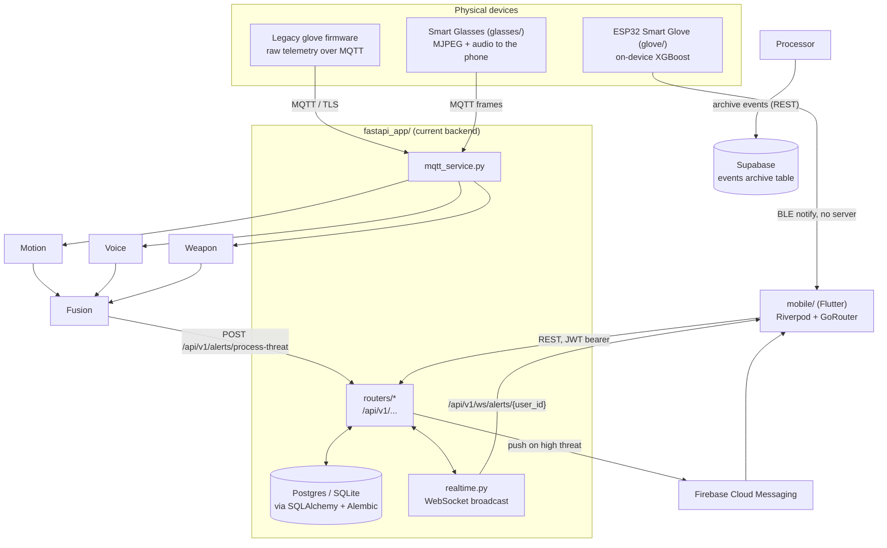
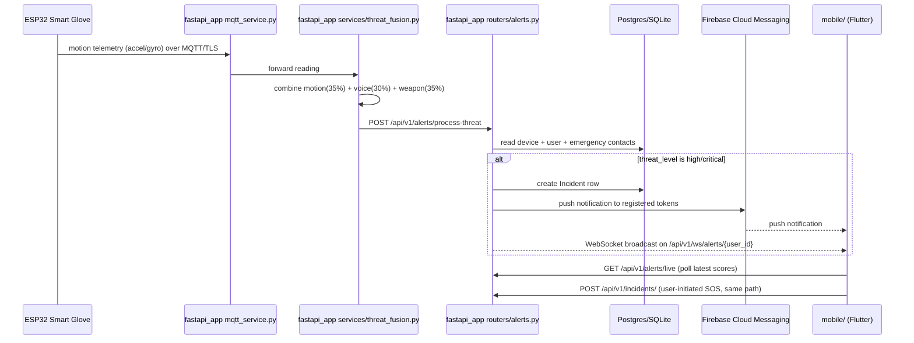
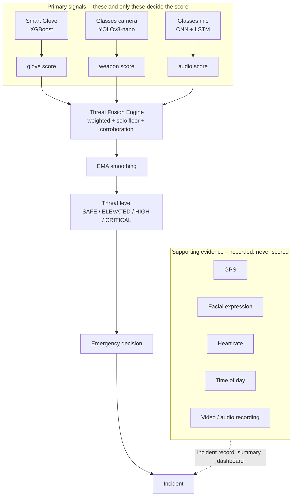
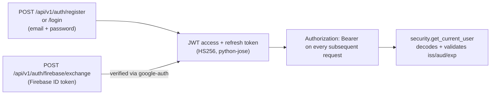

# Architecture

## System overview

SafeHer has one backend (`fastapi_app/`), one frontend (`mobile/`), and a set of
supporting systems that feed data into or receive commands from the backend. The older
Flask gateway that `fastapi_app/` replaced was deleted on 2026-08-15 after confirming
nothing imported it; it remains in git history if it is ever needed.



## Request flow: an emergency alert end to end



## The other alert path: a glove, and no server at all

The sequence above is the designed path, and every model it depends on is
untrained, so in practice it never starts. The path that does work today shares
none of it.

```mermaid
sequenceDiagram
    participant Glove as ESP32 Smart Glove (glove/)
    participant Link as GloveLink (BLE subscription)
    participant Vote as GloveAutoTrigger
    participant FGS as Foreground service
    participant UI as Emergency countdown
    participant API as fastapi_app routers/incidents.py

    Glove->>Glove: 100 Hz sampling, 51 features, XGBoost on device
    Glove->>Link: BLE notify "FALL,0.93" (every ~0.5 s)
    Link->>Vote: classification
    Vote->>Vote: 2 qualifying FALLs inside 5 s?
    Note over FGS: keeps the process alive so the<br/>notifications above still arrive off screen
    Vote->>UI: alarm request
    UI->>UI: cancellable countdown (5/10/15 s)
    UI->>API: POST /api/v1/incidents/ — the same route a manual SOS uses
```

Four properties of this path are deliberate and worth not undoing.

**No server is in the loop before the alarm.** Inference runs on the ESP32 and
reaches the phone over BLE. A dead backend, no signal, and an untrained
server-side model all leave this working.

**The vote does not live in a widget.** Flutter stops pumping frames when the
app leaves the screen, so anything decided inside a `build()` method silently
stops running when the phone is pocketed — which is the exact case the glove
exists for. It runs in a `keepAlive` Riverpod provider driven by `ref.listen`
(`mobile/lib/features/safety/data/glove_auto_trigger.dart`), and its tests run
against a bare `ProviderContainer` with no widget tree at all.

**A foreground service holds the process open.** Android freezes a backgrounded
app and stops delivering BLE callbacks. The service
(`mobile/lib/core/background/safety_foreground_service.dart`) is declared
`connectedDevice|location`, runs only while a glove is actually connected, and
reports whether it is *genuinely* running — notification permission can be
denied and OEMs kill background work. The UI only tells a user she can pocket
her phone when the platform confirms the service started.

**It opens a countdown; it never dispatches.** An automatic trigger must not be
faster, quieter, or harder to stop than one the user asked for, so it lands on
the same screen a manual SOS does. When the app is backgrounded the countdown
is routed to first and the screen woken second — the widget tree is alive
though not drawing, so the countdown is already up when the activity arrives
rather than racing it.

The BLE wire format is a contract between two codebases that cannot import each
other, duplicated in `glove/firmware/SafeHer_Glove_V5_OnDevice/` and
`mobile/lib/features/devices/domain/glove_protocol.dart`. The Dart half is
pinned by tests carrying the firmware's literal payloads; nothing can check the
firmware half automatically. See [glove/README.md](../glove/README.md).

**Two payloads exist, and the app reads both.** `SafeHer_Glove_Final/` sends
`CLASS=FALL,CONFIDENCE=0.9300` with the retired 7-class labels; `V5_OnDevice`
sends `FALL,0.93`. The alarm path and the Motion Risk card each accept either.

**Two consumers, one subscription.** Both paths listen to the same
characteristic, and the peripheral's notify flag belongs to the characteristic,
not to a subscriber. `FlutterBluePlusBleService` therefore shares one
subscription per device and characteristic, and switches notifications off only
when the last listener leaves. Before that, closing the pairing sheet switched
off the readings feeding auto-SOS.

## Threat fusion: three signals, and everything else

One engine decides whether SafeHer raises an alarm by itself:
`fastapi_app/services/threat_fusion.py`. There is no second scorer — not in
the app, not in a cloud function. The frontend displays what the engine
returns and never recomputes it.



The dotted line is the whole point: supporting evidence reaches the incident
and never the score.

**Why the separation is structural.** `ThreatSignals` has three fields and
`fuse()` accepts nothing else, so there is nowhere to pass a latitude. Someone
will one day notice that fear was on the user's face and reach for a `+0.05`;
it would look like care, and it would mean alarms during ordinary life. Adding
a fourth input requires editing the engine, which is a deliberate act with a
reviewer attached. `tests/test_fusion_architecture.py` fails if the shape
changes.

**A lone strong signal is not averaged away.** A weighted mean asks how
alarming the situation is on average, which is the wrong question when one
sensor is certain and the others have nothing to say. The score never falls
below half the strongest single reading.

**Two agreeing signals score above their mean.** Sensors on different limbs
watching different things, both alarmed, is stronger evidence than one
shouting — capped so corroboration alone can never trigger.

**What produces these scores today: all three now have a producer** (as of
2026-09-11); what none has is verification against a real feed.

- **Glove** — trained and live. Classifies on the ESP32, reaches the app over
  BLE, and raises the alarm. Firmware hardware-validated on a real ESP32-C3
  (2026-09-10); app pairing still pending.
- **Weapon** — *trained and wired.* YOLOv8n at mAP@0.5 0.907 (knife AP 0.884)
  on a held-out split. `ultralytics_weapon_detector.dart` scores frames
  on-device on Android via `ultralytics_yolo`; `remote_weapon_detector.dart`
  uploads a sampled frame to `POST /alerts/weapon-frame` on web (a weaker
  guarantee, published as such); `weapon_scorer.dart` votes over a window. It
  runs on the phone rather than the glasses — an ESP32 is two orders of
  magnitude short, and `docs/WEAPON_INFERENCE_PLACEMENT.md` has the arithmetic.
  What it lacks is a real glasses stream.
- **Audio** — *wired.* A pure-Dart TF-IDF + logistic-regression phrase
  classifier (`threat_phrase_classifier.dart` + `phrase_classifier.json`) over
  the platform speech recogniser, replacing the earlier CNN+LSTM keyword spotter
  (which scored below a fuzzy string match on real phrases). It is measured on
  synthetic and degraded TTS; a genuine distress corpus is deferred — no public
  dataset holds it — so its real-world recall is unproven.

**Facial expression** is trained too (MobileNetV3-Small, 65.5% on FER2013,
`mobile/assets/models/emotion_mobilenetv3_fp16.onnx`) and is **not** in the
list above, deliberately: it is supporting evidence and cannot reach the score.
Its `fear` class — the only one with any safety relevance — runs at 47% recall
and 56% precision, which is close to a coin toss and is the strongest practical
argument for keeping expression out of the threat decision entirely.

`threat_models.py` reports which modalities are genuinely live rather than
letting the UI imply three, and `fuse()` renormalises over whatever reported so
a missing sensor cannot quietly hold the score down.

## Auth flow

Two entry points converge on the same JWT session:



Passwords are hashed with `passlib` (`pbkdf2_sha256`, with `bcrypt` accepted for
legacy hashes). There are no server-side sessions — logout is client-side token
deletion. Full detail: [API.md](API.md#authentication), [SECURITY.md](SECURITY.md).

## Data flow and storage tiers

| Store | Holds | Written by |
|---|---|---|
| Postgres (prod) / SQLite (dev) | Users, incidents, devices, locations, media refs, notification logs, FCM tokens, emergency contacts, safe journeys, hashed safety PINs, safety-trigger preferences | `fastapi_app/repositories/*` via SQLAlchemy, schema owned by `alembic/` |
| Supabase (`events` table, `supabase_setup.sql`) | Append-only archive of raw events, parallel to the transactional DB, not a replacement for it | `deployment/docker/safeher_event_processor.py` **only**, over plain REST. `fastapi_app` never touches it — it has no Supabase settings and no client. |
| Redis | Real-time pub/sub for the event-processing pipeline (`deployment/docker/docker-compose.yml`) | `deployment/docker/safeher_event_processor.py` |
| Hive (mobile, on-device) | Auth/session state, onboarding flags, offline action queue | `mobile/lib/core/local/`, `mobile/lib/core/offline/` |
| Mosquitto (MQTT broker) | Transport only, no persistence | Devices publish, `fastapi_app/mqtt_service.py` subscribes |
| BLE (phone ↔ glove) | Transport only, nothing stored on either side. Classifications are consumed by the vote and discarded; only a resulting incident is persisted | Glove notifies, `mobile/lib/features/devices/data/glove_link_providers.dart` subscribes |

## Folder responsibilities

See [PROJECT_STRUCTURE.md](PROJECT_STRUCTURE.md) for the full tree. In one line each:

- **`fastapi_app/`** — the only backend that `mobile/` and the device firmware actually
  talk to. Owns auth, incidents, devices, notifications, alerts, and the WebSocket feed.
- **`mobile/`** — the user-facing app. Every screen is wired to the real backend by
  default (see `AppConfig.useMockApi` in `mobile/lib/core/config`); a fixture-data mock
  flavor remains available via `--dart-define=USE_MOCK_API=true` for UI-only exploration.
- **`glove/`** — the smart glove that the app actually pairs with: firmware that
  runs XGBoost on the ESP32, the labelled dataset, and the collect → train →
  convert pipeline that produces the C arrays compiled into it. The only
  detector in the system producing real scores today.
- **`glasses/`** — the XIAO ESP32-S3 Sense firmware, which runs no model and
  streams VGA MJPEG plus 16 kHz audio to the phone. An ESP32-S3 is two orders of
  magnitude short of YOLOv8n, so the phone scores the frames; see
  `WEAPON_INFERENCE_PLACEMENT.md`. Legacy sketches sit beside it under
  `glasses/firmware/legacy_*`, including one that targets a different board and
  does not compile.

  Each device now owns one folder, current and legacy firmware together. The
  earlier split — current glove under `glove/` and an older MQTT glove under
  `hardware/esp32_glove/` — put one device in two trees and read as duplication.
  The legacy MQTT sketch is kept at `glove/firmware/legacy_mqtt/` because the
  MQTT ingestion path still exists in the backend.

  No firmware exists for a "smart ring" or "pendant" despite both appearing in
  the mobile UI (see Known Gaps below).
- **`ml_models/`** — the ONNX weapon and expression models the backend loads for
  the web fallback, where the phone has no on-device runtime. Optional: both
  imports are lazy, and a deployment without them reports the modality
  unavailable rather than failing.
- **`deployment/`** — the only actively-used deployment path is
  `deployment/docker/docker-compose.yml`, a 4-container stack (Postgres, Redis,
  Mosquitto, one unified event-processor). `deployment/config/nginx.conf` and
  `prometheus.yml` describe an earlier, larger microservices design that compose
  file's own comments mark as removed.

## Backend/frontend communication

- **REST**: `mobile/` calls `fastapi_app`'s `/api/v1/*` routes over HTTPS via `dio`,
  with `Authorization: Bearer <jwt>` once authenticated.
- **Realtime**: `fastapi_app/routers/ws.py` exposes a WebSocket at
  `/api/v1/ws/alerts/{user_id}`; the mobile app's Live Monitoring/Dashboard screens
  attach to it for real `threat_alert`/`emergency_alert` events — there is no
  synthetic sensor stream anywhere in the mobile codebase.
- **Push**: high-severity alerts also go out via FCM independent of whether the app
  has an open WebSocket connection, so notifications work even when the app is backgrounded.

## Adapted from GoSecure

[GoSecure](https://github.com/Divijkatyal0406/GoSecure) (MIT) is a Flutter women-safety
app whose phone-side feature set overlaps with what SafeHer was missing. Its ideas were
evaluated feature by feature and the useful ones rebuilt inside SafeHer's architecture.
Nothing was ported: GoSecure targets pre-null-safety Dart 2.7 with a dozen abandoned
packages, so copying was never an option even where licensing allowed it.

| Idea | What SafeHer does instead |
|---|---|
| Nearby safety spots | GoSecure opens a `google.com/maps/search?q=police+station` URL — no coordinates, no distances, nothing structured. SafeHer proxies **OpenStreetMap Overpass** through `GET /api/v1/safety/nearby`, returning real tagged places with computed haversine distances, phone numbers where OSM has them, and a 5-minute server-side cache. Keyless, so no Places billing. |
| Periodic location sharing | GoSecure loops an SMS containing a maps link, with contacts in `SharedPreferences`. SafeHer models it as a **Safe Journey** with a deadline: breadcrumbs go into the existing `locations` table tagged with `journey_id`, contacts come from the existing `emergency_contacts` table, and the overdue policy is server-side and explicit. |
| Safety PIN | GoSecure keeps the PIN in device preferences. SafeHer hashes it server-side with the same passlib context as account passwords, rate-limits wrong guesses, and gates SOS cancellation on it. |
| Shake detection | Kept as an **opt-in fallback** for when the Smart Glove isn't worn — the glove's own motion sensing remains primary. Requires three deliberate shakes inside 1.5 s with a 10 s cooldown, and opens the normal SOS countdown rather than dispatching. |
| Voice commands | Rebuilt as an on-device recogniser over a **fixed allow-list**. Critical actions keep their guards: SOS opens the countdown, and cancelling still meets the PIN gate — a voice anyone nearby can imitate must not silence an alarm. |
| Fake call, helplines, articles, self-defence | Rebuilt with SafeHer's design system. Helpline numbers carry their source and verification date, and the screen states its country scope. Guides are original text — GoSecure's bundled articles and video embeds had unclear licensing. |
| Scream detection | **Rejected.** GoSecure thresholds a `noise_meter` dB reading, which is loudness detection, not scream detection. SafeHer already runs real voice analysis server-side on the Smart Glasses mic; adding a competing client-side detector would be both a duplicate and a weaker one. |
| Spy-camera detection (magnetometer) | **Rejected.** A magnetometer cannot reliably detect hidden cameras. Shipping it — even labelled "experimental" — would tell a user in an unsafe room that a check had cleared it. |

## Known gaps

Carried forward from the pre-audit documentation (since removed; in git
history), reconfirmed during the 2026-08-08 audit, and revised on 2026-09-11:

- The audio corpus is synthetic speech with a realistically degraded channel.
  Nobody in it is genuinely frightened; recording real distress speech is the
  honest next step but is deferred for now (no public dataset supplies it).
- No firmware exists for the "smart ring" or "pendant" device concepts shown in the
  mobile UI — only the glove and glasses are real.
- **The glove firmware is hardware-validated; the app path is not.** A real
  ESP32-C3 was exercised on 2026-09-10 (MPU-6500, 100 Hz sampling, on-device
  inference timing — `glove/firmware/SafeHer_Glove_Final/HARDWARE_VALIDATION_REPORT.md`),
  but **no physical glove has ever been paired with the app**: the whole app-side
  path — the classification notify, the vote, the foreground service, the woken
  screen — has only ever run against `FakeBleService`, and physical motion/FALL/BLE
  behaviour is untested. This is the largest untested surface in the project.
- The foreground service is built and present in the merged manifest, but no
  one has put a phone in a pocket and confirmed an alarm still gets out. The UI
  is written so that an unstarted service reads as a stated limitation rather
  than a silent one.
- Heart rate and battery are not implemented in the glove firmware. The
  telemetry characteristic sends zeros for both; the app reads a zero heart
  rate as "no sensor" rather than as a measurement.
- The weapon, audio and expression models cannot be retrained from a clean clone
  — their datasets are gigabytes and live outside this repository. Only the
  shipped artifacts and their measured results are committed. The glove's model
  *is* reproducible here, from `glove/ml/`.
